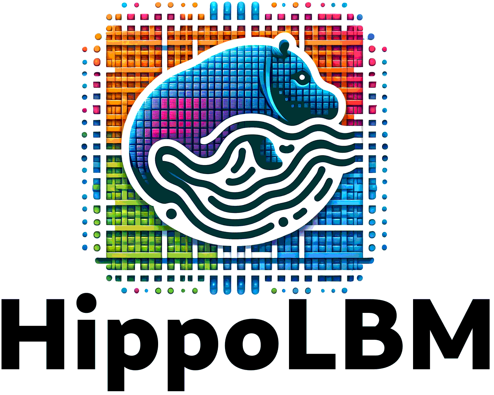

# hippoLBM

``HippoLBM`` is a high-performance Lattice Boltzmann Method (LBM) simulation code developed in C++ and built on the ``Onika`` runtime. It is designed for large-scale fluid dynamics simulations and features a parallelization strategy to maximize computational efficiency. ``HippoLBM`` integrates hybrid MPI + OpenMP parallelism for CPU execution and CUDA acceleration for GPU architectures, ensuring scalability across different hardware configurations.

One of ``HippoLBM``’s key strengths is its ability to couple with other physics solvers, enabling multiphysics simulations. With a focus on modularity and extensibility, HippoLBM provides researchers and engineers with a flexible and efficient tool for tackling complex fluid dynamics problems in high-performance computing environments.

# Installation

See the [Installation guidlines](https://collab4exanbody.github.io/doc_hippoLBM/pages/Install.html).

# Documentation
See the [Documentation website](https://collab4exanbody.github.io/doc_hippoLBM/index.html).

# Community Guidelines

For more details, see CONTRIBUTING.md. Main guidelines are:

- For any bug, please create an issue and add the label “bug”. We welcome all feedback to make exaDEM as robust as possible.
- If you would like to participate and add functionality to `hippoLBM`, you can find instructions for coding style, tests and pull request process in `CONTRIBUTING.md`.
- If you have any support-related / collaboration questions, please contact the team at `raphael.prat@cea.fr`.

# Authors and acknowledgment

Main developers:
  - Raphaël Prat (CEA/DES) (raphael.prat@cea.fr)
  - Lhassan Amarsid (CEA/DES)

Contributors:
  - Guillaume bareigts (CEA/DES)
  - Jean-Yves delenne (INRAE)
  - Farhang Radjaï (LMGC/CNRS)
  - Abdelbarie El Metni 
