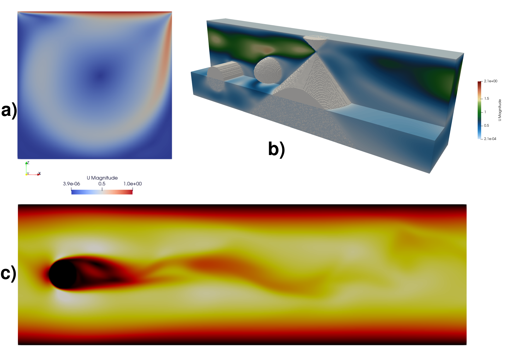
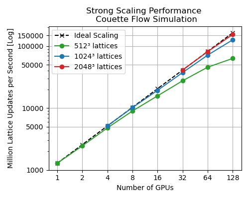
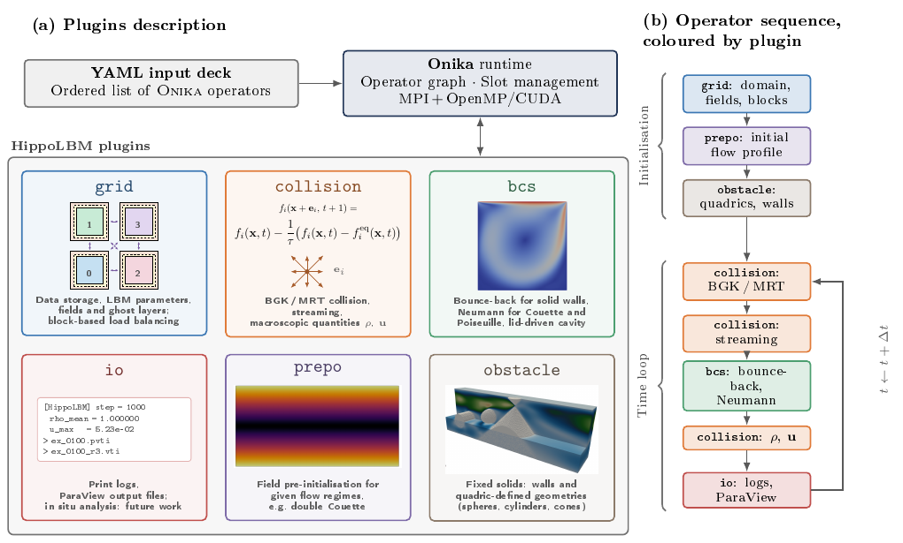

# Introduction

<!--
La méthode Boltzmann sur réseau a été introduite il y a ... et permet de simuler le comportement d'un fluide ... L'un des avantages de cette méthode est qu'elle est nativement parallèle avec des calculs indépendants en chaque point de la grille LBM. De plus, due à l'utilisation de grille régulière (cartésienne), cette méthode a largement été portée sur GPU et permet de réaliser des scénarios à grande échelle avec des milliards de nœuds.

Ce qui nous intéresse avec cette méthode, c'est la possibilité de la coupler avec d'autres méthodes via la méthode de l'immersed boundary pour effectuer des scénarios d'intérêt dans le domaine nucléaire, notamment dans le cas de scénarios APRP lorsqu'une brèche est créée dans une gaine, créant une dépression et propulsant des particules hors du crayon.

Pour faciliter ce type de couplage, un framework permettant d'écrire chaque opération élémentaire (IO, numerical scheme, analysis) comme un opérateur et reliés les uns aux autres via des slots a été mis en place. Dans ce papier nous nous intéressons au code `HippoLBM` qui est issu d'une partie du code legacy effectuant de la LBMDEM dont les structures de données ont été adaptées pour le portage sur GPU et à une parallélisation hybride MPI + GPU.
-->

The Lattice Boltzmann Method (LBM) (LHASSAN ADD REF) is a longstanding numerical approach for fluid simulation that inherently exposes fine-grained parallelism: updates at each lattice node are locally independent. Its use of a regular Cartesian mesh facilitates efficient GPU implementations, enabling simulations at very large scale—ranging up to billions of lattice nodes.

This method is particularly attractive because it can be coupled with other techniques using for example the Immersed Boundary Method (IBM), enabling the simulation of nuclear-relevant scenarios such as Loss-Of-Coolant Accidents (LOCA), in which a breach in the fuel cladding induces a pressure drop and ejects particles from the fuel rod (LHASSAN ADD REF).

To enable such couplings, we developed a framework that expresses each elementary operation (I/O, numerical schemes, analyses) as an operator and connects operators via slots. In this paper, we concentrate on the `HippoLBM` code, derived from legacy LBM/DEM software and refactored for GPU execution and hybrid MPI+GPU parallelization.

# Statement of need
<!--
`HippoLBM` is CFD code writen in C++ 20 ...
`HippoLBM` a pour objectif de proposer un outil performant sur CPU et GPU pour effectuer des couplages LBM+X en utilisant le formalisme Onika qui permet de créer des graphes d'exécution à partir d'une liste d'opérateurs.

Un opérateur peut être l'appel à un kernel de calcul comme l'étape de collision BGK ou MRT, l'initialisation d'un champ, des sorties ParaView ou n'importe quelle étape ou liste d'étapes lors du calcul. Dans `HippoLBM`, nous cherchons à proposer une granularité fine de ces opérateurs pour pouvoir construire des couplages avec d'autres codes utilisant eux aussi le formalisme Onika. 

Le premier cas d'utilisation a été réalisé en couplant `HippoLBM` avec le code `exaDEM` pour effectuer des simulations DEM/LBM.

Concernant les fonctionnalités de performance, `HippoLBM` propose une parallélisation hybride `MPI` + `X`, `X`=`OpenMP` ou `CUDA`, en utilisant les méthodes et stratégies classiques de parallélisation de la méthode LBM (décomposition spatiale du domaine, optimisation GPU TODO). Néanmoins, certaines stratégies comme l'utilisation de méthode de raffinement adaptatif de maillage ou la fusion automatique de kernel n'ont pas été intégrées.
-->

`HippoLBM` is a C++20 LBM code that aims to provide a high-performance tool for LBM+X coupling on both CPU and GPU, using the `Onika` formalism [@carrard2023exanbody] to build execution graphs from a list of operators.
In `HippoLBM`, an operator can be a compute kernel call such as the BGK or MRT collision step, a field initialization, a ParaView output, or any other step or sequence of steps in the computation. We target fine operator granularity to enable couplings with other codes that also use the `Onika` formalism. The first use case was coupling `HippoLBM` with the `exaDEM` code [@prat2025exadem] for DEM/LBM simulations using R-shaped particles.

{width=70%} 

Regarding performance, `HippoLBM` supports hybrid MPI+X parallelization, where X is either OpenMP or CUDA, and relies on standard LBM parallelization strategies (spatial domain decomposition, GPU optimization [@tran2017performance]). However, some strategies such as adaptive mesh refinement or automatic kernel fusion [@mahmoud2024optimized] are not yet implemented. `HippoLBM` has been tested on 192 NVIDIA A100 GPUs and can handle around 69 billion LB points (see \autoref{fig:perf}).

{width=60%} 

# State of the field                                                                                                                  

<!--
Dans le domaine des codes utilisant la méthode Lattice de Boltzmann en 3D, plusieurs codes proposent des fonctionnalités physiques plus avancées qu'`HippoLBM` comme `ProLB` qui permet de simuler des fluides compressibles ou `LBMSaclay` permettant de réaliser des simulations multiphase.

`HippoLBM` se différencie principalement de l'état de l'art plus dans sa conception que dans ses fonctionnalités physiques ou HPC qui pourront être enrichies par la suite, afin de s'intégrer dans des écosystèmes complexes et multi-physiques.
-->

In the field of codes using the 3D Lattice Boltzmann Method, several codes offer more advanced physical capabilities than `HippoLBM`, such as `ProLB` [@feng2021prolb], which can simulate compressible fluids, OpenLB [@heuveline2007openlb]  with XXX, or `LBMSaclay` [@cartalade2016lattice](check ref), which enables multiphase simulations. 

`HippoLBM` differs from the state of the art mainly in its design rather than in its physical or HPC capabilities, which can be further enriched in the future in order to integrate into complex, multi-physics ecosystems. Note that waLBerla [@bauer2021walberla] + , Palabos [@latt2021palabos] with LIGGGTHS proposes multiphysic couplings with HPC features.

# Software design
<!--
`HippoLBM`'s design philosophy is to decompose the LBM simulations on a list of `onika` operators. 
`HippoLBM` est composé de plusieurs plugins, actuellement tous les plugins présents forment le cœur d'`HippoLBM`:
plugin grid: Ce plugin contient la plupart des structures de données comme les champs, les données sur le domaine, les paramètres LBM et propose tous les opérateurs permettant de modifier/initialiser ces structures de données, notamment l'équilibrage de charge (block).
plugin collision: Ce plugin permet d'appliquer les étapes élémentaires de la LBM comme l'application de l'opérateur de collision BGK ou MRT, la phase de streaming ou le calcul des quantités macros comme la vitesse et la pression.
plugin bcs: Ce plugin contient les noyaux de calculs pour appliquer les conditions limites comme des conditions de Neumann utilisées pour des cas tests académiques comme un écoulement de Couette ou de Poiseuille, bounce back pour modéliser des solides, ou des conditions limites spécifiques pour mettre en place des cavités entraînées.
plugin IO: Ce plugin est actuellement utilisé pour afficher des logs et effectuer des sorties ParaView (post-traitement). Il a aussi vocation à évoluer pour intégrer des analyses in-situ.
plugin Prepo: Ce plugin propose de pré-initialiser les champs pour des régimes très précis comme par exemple un double Couette.
plugin Obstacle: Ce plugin permet de placer des objets solides inamovibles comme des murs.
-->

`HippoLBM`'s design philosophy is to decompose LBM simulations into a list of `Onika` operators. To that end, it is organized into several plugins, all of which currently form the core of HippoLBM:

- `grid`: This plugin contains most of the data structures, such as fields, domain data, and LBM parameters, and provides all operators for modifying and initializing these data structures, including load balancing (block).
- `collision`: This plugin applies the elementary steps of LBM, such as the BGK or MRT collision operator, the streaming phase, and the computation of macroscopic quantities (e.g., velocity and pressure).
- `bcs`: This plugin contains the compute kernels for applying boundary conditions (e.g., Neumann conditions for Couette or Poiseuille flows, bounce-back for solid boundaries, or lid-driven cavity setups).
- `io`: This plugin is currently used to display logs and produce ParaView output files for post-processing. Future developments will extend it to support in-situ analysis.
- `prepo`: This plugin provides pre-initialization of fields for specific flow regimes, such as double Couette flow.
- `obstacle`: This plugin allows placing fixed solid objects, such as walls or geometries defined by quadrics, see \autoref{fig:examples}.b, within the simulation domain. 

{width=100%}

# Research impact statement

The legacy (non-HPC) code was used to perform 2D LBM/DEM simulations on ... [@amarsid2017viscoinertial]. `HippoLBM` aims to explore large-scale 3D simulations in LBM and coupling. Through its interface with `Onika`, `HippoLBM` could be coupled to physics other than DEM using methods such as the Material Point Method (MPM), the Finite Element Method (FEM), or the Finite Difference Method (FDM).

# AI usage disclosure

No generative AI tools were used in the design and development of this software; however, they were used for refactoring and renaming classes.
Generative AI tools were used to generate post processing python script, doxygen code, and to translate texts for website documentation.

# Acknowledgements

This work was performed using HPC resources from CCRT funded by the CEA/DEs simulation program. `HippoLBM` is part of the `PLEIADES` platform which has been developped in collaboration with the French nuclear industry - mainly CEA, EDF, and Framatome - for simulation of fuel elements.

# References
