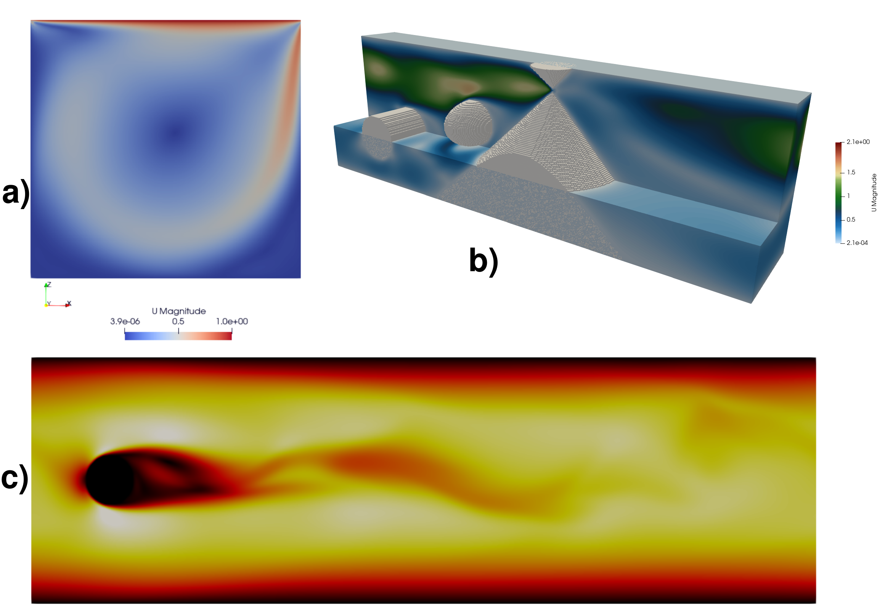
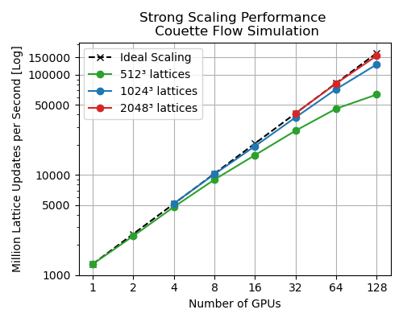

# Introduction

The Lattice Boltzmann Method (LBM) [@PhysRevLett.61.2332] is a numerical method for computational fluid dynamics (CFD) based on a mesoscopic description of fluid dynamics. Unlike classical methods for solving the Navier-Stokes equations, which directly describe the evolution of macroscopic quantities such as velocity and pressure, LBM governs the spatio-temporal evolution of distribution functions representing the statistical behavior of the particles making up the fluid. This approach originates from the kinetic theory of gases [@chapman1916mathematical]. Instead of directly solving the macroscopic equations of fluid motion, LBM describes the evolution of distribution functions associated with fictitious particles moving along a discrete set of directions defined on a regular lattice.

One of the main advantages of LBM lies in its local and explicit formulation. Computations are performed only between neighboring lattice nodes, which enables efficient parallelization on modern computing architectures such as multicore CPUs and GPU accelerators. This feature makes the method particularly well suited to high-resolution three-dimensional simulations, and it inherently exposes fine-grained parallelism since updates at each lattice node are locally independent. Its use of a regular Cartesian mesh further facilitates efficient GPU implementations, enabling simulations at very large scale, ranging up to billions of lattice nodes.

LBM also offers great flexibility for representing complex geometries and boundary conditions that are difficult to handle with classical methods. Various collision models have been developed to improve numerical stability [@PhysRevE.61.6546] and extend the range of applications of the method, including Multiple Relaxation Time (MRT) models, entropic models, and cumulant-based approaches [@krueger2017lattice]. Despite its many advantages, LBM has some limitations. Its classical formalism relies on a low-compressibility assumption and is therefore mainly suited to flows characterized by low Mach numbers. In addition, difficulties can arise in situations with strong pressure gradients or highly turbulent regimes. These limitations are nonetheless the subject of extensive ongoing work aimed at improving numerical stability and broadening the range of application of the method.

This method remains particularly attrative for multiphysics simulations, as it can be easily coupled with other physical models. In particular, its combination with discrete particle methods through the Immersed Boundary Method(IBM) provides an efficient framework for simulating complex fluid-particle interactions relevant to nuclear engineering scenarii.  To implement such couplings, we developed a framework that expresses each elementary operation (I/O, numerical schemes, analyses) as an operator and connects operators via slots. In this paper, we concentrate on the `HippoLBM` code, derived from legacy LBM/DEM software and refactored for GPU execution and hybrid MPI+GPU parallelization.

# Principle of the LBM

As mentionned before, the LBM is a mesoscopic approach derived from the kinetic theory of gases. Instead of solving the macroscopic Navier-Stokes equations directly, it solves a discretiezed form of the Boltzmann equation for the particle distribution function :

$$
\frac{\partial f(\mathbf{r},\boldsymbol{\xi},t)}{\partial t}
+\boldsymbol{\xi}\cdot\nabla_{\mathbf{r}} f(\mathbf{r},\boldsymbol{\xi},t)
=\Omega(f),
$$

where $f(\mathbf{r},\boldsymbol{\xi},t)$ is the particle distribution function, $\mathbf{r}$ denotes the spatial position, $\boldsymbol{\xi}$ is the microscopic particle velocity, and $\Omega(f)$ represents the collision operator.

The LBM is obtained by discretizing the velocity space into a finite set of discrete velocities $\boldsymbol{e}_i$, while the distribution function is replaced by a set of discrete populations $f_i(\mathbf{r},t)$. Using a regular lattice and BGK collision operator (*Bhatnagar-Gross-Krook*), the streaming and collision processes can be separated, leading to the following discrete Boltzmann equation:

$$
f_i^*(\mathbf{r},t) = f_i(\mathbf{r},t) - \frac{\Delta t}{\tau}\left(f_i(\mathbf{r},t)-f_i^{eq}(\mathbf{r},t)\right),
$$

where $\tau$ is the relaxation time and $f_i^*$ is the distribution function after the collision step.

The equilibrium distribution function $f_i^{eq}$ is obtained from a truncated expansion of the Maxwell-Boltzmann distribution to second order in Mach number, and is written as:

$$
f_i^{eq}(\mathbf{r},t) = w_i \rho(\mathbf{r},t)\left[1 + \frac{\mathbf{e}_i\cdot\mathbf{u}(\mathbf{r},t)}{c_s^2} + \frac{\left(\mathbf{e}_i\cdot\mathbf{u}(\mathbf{r},t)\right)^2}{2c_s^4} - \frac{\mathbf{u}(\mathbf{r},t)\cdot\mathbf{u}(\mathbf{r},t)}{2c_s^2}\right],
$$

where $w_i$ is the weight associated with discrete direction $\mathbf{e}_i$, $\rho$ is the fluid density, $\mathbf{u}$ is the macroscopic velocity, and $c_s$ is the lattice speed of sound. This approximation is valid in the low Mach number limit ($Ma \ll 1$).

After the collision step, the distribution functions are streamed to neighboring lattice nodes along the discrete directions $\mathbf{e}_i$:

$$
f_i(\mathbf{r}+\mathbf{e}_i\Delta t,t+\Delta t) = f_i^*(\mathbf{r},t).
$$

The macroscopic fluid quantities are obtained by computing the moments of the distribution functions:

$$
\rho(\mathbf{r},t) = \sum_i f_i(\mathbf{r},t),
$$

and

$$
\rho\mathbf{u}(\mathbf{r},t) = \sum_i f_i(\mathbf{r},t)\mathbf{e}_i .
$$

The relaxation parameter $\tau$ plays a fundamental role in LBM, as it controls the dissipative properties of the fluid. In the BGK model, the relaxation time is directly related to the kinematic viscosity $\nu$ of the fluid through the relation:

$$
\nu = c_s^2\left(\tau-\frac{\Delta t}{2}\right),
$$

where $c_s$ is the lattice speed of sound and $\Delta t$ is the time step. This relation shows that the fluid viscosity is directly determined by the time required for the distribution functions to relax toward their equilibrium state. Through a Chapman-Enskog asymptotic expansion, it can be shown that LBM recovers the macroscopic mass and momentum conservation equations in the low Mach number limit. This expansion relies on a separation of spatial and temporal scales, establishing the link between the mesoscopic description of the distribution functions and the macroscopic equations of fluid mechanics [@chapman1916mathematical; @krueger2017lattice].

# Statement of need

`HippoLBM` is a C++20 LBM code that aims to provide a high-performance tool for LBM+X coupling on both CPU and GPU, using the `Onika` formalism [@carrard2023exanbody] to build execution graphs from a list of operators.
In `HippoLBM`, an operator can be a compute kernel call such as the BGK or MRT collision step, a field initialization, a ParaView output, or any other step or sequence of steps in the computation. We target fine operator granularity to enable couplings with other codes that also use the `Onika` formalism. The first use case was coupling `HippoLBM` with the `exaDEM` code [@prat2025exadem] for DEM/LBM simulations using R-shaped particles.

{width=70%} 

Regarding performance, `HippoLBM` supports hybrid MPI+X parallelization, where X is either OpenMP or CUDA, and relies on standard LBM parallelization strategies (spatial domain decomposition, GPU optimization [@tran2017performance]). However, some strategies such as adaptive mesh refinement or automatic kernel fusion [@mahmoud2024optimized] are not yet implemented. `HippoLBM` has been tested on 192 NVIDIA A100 GPUs and can handle around 69 billion LB points (see \autoref{fig:perf}).

{width=60%} 

# State of the field                                                                                                                  

In the field of codes using the 3D Lattice Boltzmann Method, several codes offer more advanced physical capabilities than `HippoLBM`, such as open source codes `OpenLB` [@heuveline2007openlb], which provides a broad, general-purpose set of physical models (e.g., thermal, particulate, and free-surface flows), or `LBMSaclay` [@cartalade2016lattice], which enables multiphase simulations. Non-open-source codes such as `ProLB` [@feng2021prolb], which can simulate compressible fluids, or `PowerFLOW`®.

`HippoLBM` differs from the state of the art mainly in its design rather than in its physical or HPC capabilities, which can be further enriched in the future in order to integrate into complex, multi-physics ecosystems. Note that waLBerla [@bauer2021walberla] and Palabos [@latt2021palabos] with LIGGGHTS propose multiphysics couplings with HPC features.

# Software design

`HippoLBM`'s design philosophy is to decompose LBM simulations into a list of `Onika` operators. To that end, it is organized into several plugins, all of which currently form the core of HippoLBM:

- `grid`: This plugin contains most of the data structures, such as fields, domain data, and LBM parameters, and provides all operators for modifying and initializing these data structures, including load balancing (block).
- `collision`: This plugin applies the elementary steps of LBM, such as the BGK or MRT collision operator, the streaming phase, and the computation of macroscopic quantities (e.g., velocity and pressure).
- `bcs`: This plugin contains the compute kernels for applying boundary conditions (e.g., Neumann conditions for Couette or Poiseuille flows, bounce-back for solid boundaries, or lid-driven cavity setups).
- `io`: This plugin is currently used to display logs and produce ParaView output files for post-processing. Future developments will extend it to support in-situ analysis.
- `prepro`: This plugin provides pre-initialization of fields for specific flow regimes, such as double Couette flow.
- `obstacle`: This plugin allows placing fixed solid objects, such as walls or geometries defined by quadrics, see \autoref{fig:examples}.b, within the simulation domain. 

{width=100%}

# Research impact statement

The legacy (non-HPC) code was used to perform 2D LBM/DEM simulations on ... [@amarsid2017viscoinertial]. `HippoLBM` aims to explore large-scale 3D simulations in LBM and coupling. Through its interface with `Onika`, `HippoLBM` could be coupled to physics other than DEM using methods such as the Material Point Method (MPM) [@xiao2026volume], the Finite Element Method (FEM), or the Finite Difference Method (FDM).

# AI usage disclosure

No generative AI tools were used in the design and development of this software; however, they were used for refactoring and renaming classes.
Generative AI tools were used to generate post processing python script, doxygen code, and to translate texts for website documentation.

# Acknowledgements

This work was performed using HPC resources from CCRT funded by the CEA/DEs simulation program. `HippoLBM` is part of the `PLEIADES` platform which has been developed in collaboration with the French nuclear industry - mainly CEA, EDF, and Framatome - for simulation of fuel elements.

# References
